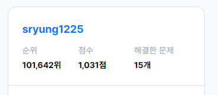

# 🤮 JavaScript 알고리즘 문제 풀이

## 👋 소개

코딩 테스트를 대비하기 위하여 JavaScript로 알고리즘 문제를 풀이합니다.

문제 풀이를 완료하는 경우 커밋을 진행합니다.

### 🌱 현재 단계
- 3주차
- 프로그래머스 코딩테스트 입문 Level 0 풀이
- 

### 🎒 (메모) 문제 풀이 플랫폼 추천
- [프로그래머스](https://programmers.co.kr/)
- [백준](https://www.acmicpc.net/step)
  - [문제 추천](https://devjeong.com/algorithm/algorithm-1/#코딩-테스트-대비-백준-문제-추천)
- [제코베](https://paullab.co.kr/codefestival.html)
- [SW역량테스트](https://swexpertacademy.com/main/capacityTest/main.do)

 

## 💡 풀이 저장

> 상세 풀이법을 포함한 내용은 [Notion](https://eve1225.notion.site/7d0a802bb0da46fda1dec663bd41efb9?v=4bda3b722aab427d90e1a3fcc6facf2c) 을 통해서 확인 가능합니다.

### 프로그래머스
| 단계 | 문제 | 풀이 |
| ---- | ------- | ------- |
| 0 | [두 수의 합](https://school.programmers.co.kr/learn/courses/30/lessons/120802) | [두수의합.js](./Level0/두수의합.js)
| 0 | [두 수의 차](https://school.programmers.co.kr/learn/courses/30/lessons/120803) | [두수의차.js](./Level0/두수의차.js)
| 0 | [두 수의 곱](https://school.programmers.co.kr/learn/courses/30/lessons/120804) | [두수의곱.js](./Level0/두수의곱.js)
| 0 | [몫 구하기](https://school.programmers.co.kr/learn/courses/30/lessons/120805) | [몫구하기.js](./Level0/몫구하기.js)
| 0 | [두 수의 나눗셈](https://school.programmers.co.kr/learn/courses/30/lessons/120806) | [두수의나눗셈.js](./Level0/두수의나눗셈.js)
| 0 | [숫자 비교하기](https://school.programmers.co.kr/learn/courses/30/lessons/120807) | [숫자비교하기.js](./Level0/숫자비교하기.js)
| 0 | [분수의 덧셈](https://school.programmers.co.kr/learn/courses/30/lessons/120808) | [분수의덧셈.js](./Level0/분수의덧셈.js)
| 0 | [배열 두 배 만들기](https://school.programmers.co.kr/learn/courses/30/lessons/120809) | [배열두배만들기.js](./Level0/배열두배만들기.js)
| 0 | [나머지 구하기](https://school.programmers.co.kr/learn/courses/30/lessons/120810) | [나머지구하기.js](./Level0/나머지구하기.js)
| 0 | [중앙값 구하기](https://school.programmers.co.kr/learn/courses/30/lessons/120811) | [중앙값구하기.js](./Level0/중앙값구하기.js)
| 0 | [최빈값 구하기](https://school.programmers.co.kr/learn/courses/30/lessons/120812) | [최빈값구하기.js](./Level0/최빈값구하기.js)
| 0 | [짝수는 싫어요](https://school.programmers.co.kr/learn/courses/30/lessons/120813) | [짝수는싫어요.js](./Level0/짝수는싫어요.js)
| 0 | [피자 나눠 먹기 (1)](https://school.programmers.co.kr/learn/courses/30/lessons/120814) | [피자나눠먹기(1).js](./Level0/피자나눠먹기(1).js)
| 0 | [피자 나눠 먹기 (2)](https://school.programmers.co.kr/learn/courses/30/lessons/120815) | [피자나눠먹기(2).js](./Level0/피자나눠먹기(2).js)
| 0 | [피자 나눠 먹기 (3)](https://school.programmers.co.kr/learn/courses/30/lessons/120816) | [피자나눠먹기(3).js](./Level0/피자나눠먹기(3).js)
| 0 | [배열의 평균값](https://school.programmers.co.kr/learn/courses/30/lessons/120817) | [배열의평균값.js](./Level0/배열의평균값.js)
| 0 | [옷가게 할인 받기](https://school.programmers.co.kr/learn/courses/30/lessons/120818) | [옷가게할인받기.js](./Level0/옷가게할인받기.js)
| 0 | [아이스 아메리카노](https://school.programmers.co.kr/learn/courses/30/lessons/120819) | [아이스아메리카노.js](./Level0/아이스아메리카노.js)
| 0 | [나이 출력](https://school.programmers.co.kr/learn/courses/30/lessons/120820) | [나이출력.js](./Level0/나이출력.js)
| 0 | [배열 뒤집기](https://school.programmers.co.kr/learn/courses/30/lessons/120821) | [배열뒤집기.js](./Level0/배열뒤집기.js)
| 0 | [문자열 뒤집기](https://school.programmers.co.kr/learn/courses/30/lessons/120822) | [문자열뒤집기.js](./Level0/문자열뒤집기.js)
| 0 | [직각삼각형 출력하기](https://school.programmers.co.kr/learn/courses/30/lessons/120822) | [문자열뒤집기.js](./Level0/문자열뒤집기.js)
| 0 | [문자열 뒤집기](https://school.programmers.co.kr/learn/courses/30/lessons/120822) | [문자열뒤집기.js](./Level0/문자열뒤집기.js)
| 0 | [직각삼각형 출력하기](https://school.programmers.co.kr/learn/courses/30/lessons/120823) | [직각삼각형출력하기.js](./Level0/직각삼각형출력하기.js)
| 0 | [짝수 홀수 개수](https://school.programmers.co.kr/learn/courses/30/lessons/120824) | [짝수홀수개수.js](./Level0/짝수홀수개수.js)
| 0 | [문자 반복 출력하기](https://school.programmers.co.kr/learn/courses/30/lessons/120825) | [문자반복출력하기.js](./Level0/문자반복출력하기.js)
| 0 | [특정 문자 제거하기](https://school.programmers.co.kr/learn/courses/30/lessons/120826) | [특정문자제거하기.js](./Level0/특정문자제거하기.js)
| 0 | [각도기](https://school.programmers.co.kr/learn/courses/30/lessons/120829) | [각도기.js](./Level0/각도기.js)
| 0 | [양꼬치](https://school.programmers.co.kr/learn/courses/30/lessons/120830) | [양꼬치.js](./Level0/양꼬치.js)
| 0 | [짝수의 합](https://school.programmers.co.kr/learn/courses/30/lessons/120831) | [짝수의합.js](./Level0/짝수의합.js)
| 0 | [배열 자르기](https://school.programmers.co.kr/learn/courses/30/lessons/120833) | [배열자르기.js](./Level0/배열자르기.js)
| 0 | [외계행성의 나이](https://school.programmers.co.kr/learn/courses/30/lessons/120834) | [외계행성의나이.js](./Level0/외계행성의나이.js)
| 0 | [진료순서 정하기](https://school.programmers.co.kr/learn/courses/30/lessons/120835) | [진료순서정하기.js](./Level0/진료순서정하기.js)
| 0 | [순서쌍의 개수](https://school.programmers.co.kr/learn/courses/30/lessons/120836) | [순서쌍의개수.js](./Level0/순서쌍의개수.js)
| 0 | [개미군단](https://school.programmers.co.kr/learn/courses/30/lessons/120837) | [개미군단.js](./Level0/개미군단.js)
| 0 | [모스부호 (1)](https://school.programmers.co.kr/learn/courses/30/lessons/120838) | [모스부호(1).js](./Level0/모스부호(1).js)
| 0 | [가위 바위 보](https://school.programmers.co.kr/learn/courses/30/lessons/120839) | [가위바위보.js](./Level0/가위바위보.js)
| 0 | [구슬을 나누는 경우의 수](https://school.programmers.co.kr/learn/courses/30/lessons/120840) | [구슬을나누는경우의수.js](./Level0/구슬을나누는경우의수.js)
| 0 | [점의 위치 구하기](https://school.programmers.co.kr/learn/courses/30/lessons/120841) | [점의위치구하기.js](./Level0/점의위치구하기.js)
| 0 | [2차원으로 만들기](https://school.programmers.co.kr/learn/courses/30/lessons/120842) | [2차원으로만들기.js](./Level0/2차원으로만들기.js)
| 0 | [공 던지기](https://school.programmers.co.kr/learn/courses/30/lessons/120843) | [공던지기.js](./Level0/공던지기.js)
| 0 | [배열 회전시키기](https://school.programmers.co.kr/learn/courses/30/lessons/120844) | [배열회전시키기.js](./Level0/배열회전시키기.js)
| 0 | [주사위의 개수](https://school.programmers.co.kr/learn/courses/30/lessons/120845) | [주사위의개수.js](./Level0/주사위의개수.js)
| 0 | [합성수 찾기](https://school.programmers.co.kr/learn/courses/30/lessons/120846) | [합성수찾기.js](./Level0/합성수찾기.js)
| 0 | [최대값 만들기 (1)](https://school.programmers.co.kr/learn/courses/30/lessons/120847) | [최대값만들기(1).js](./Level0/최대값만들기(1).js)
| 0 | [팩토리얼](https://school.programmers.co.kr/learn/courses/30/lessons/120848) | [팩토리얼.js](./Level0/팩토리얼.js)
| 0 | [모음 제거](https://school.programmers.co.kr/learn/courses/30/lessons/120849) | [모음제거.js](./Level0/모음제거.js)
| 0 | [문자열 정렬하기 (1)](https://school.programmers.co.kr/learn/courses/30/lessons/120850) | [문자열정렬하기(1).js](./Level0/문자열정렬하기(1).js)
| 0 | [숨어있는 숫자의 덧셈 (1)](https://school.programmers.co.kr/learn/courses/30/lessons/120851) | [숨어있는숫자의덧셈(1).js](./Level0/숨어있는숫자의덧셈(1).js)
| 0 | [소인수분해](https://school.programmers.co.kr/learn/courses/30/lessons/120852) | [소인수분해.js](./Level0/소인수분해.js)
| 0 | [컨트롤 제트](https://school.programmers.co.kr/learn/courses/30/lessons/120853) | [컨트롤제트.js](./Level0/컨트롤제트.js)
| 0 | [배열 원소의 길이](https://school.programmers.co.kr/learn/courses/30/lessons/120854) | [배열원소의길이.js](./Level0/배열원소의길이.js)
| 0 | [중복된 문자 제거](https://school.programmers.co.kr/learn/courses/30/lessons/120888) | [중복된문자제거.js](./Level0/중복된문자제거.js)
| 0 | [삼각형의 완성조건 (1)](https://school.programmers.co.kr/learn/courses/30/lessons/120889) | [삼각형의완성조건(1).js](./Level0/삼각형의완성조건(1).js)
| 0 | [가까운 수](https://school.programmers.co.kr/learn/courses/30/lessons/120890) | [가까운수.js](./Level0/가까운수.js)
| 0 | [369게임](https://school.programmers.co.kr/learn/courses/30/lessons/120891) | [369게임.js](./Level0/369게임.js)
| 0 | [암호 해독](https://school.programmers.co.kr/learn/courses/30/lessons/120892) | [암호해독.js](./Level0/암호해독.js)
| 0 | [대문자와 소문자](https://school.programmers.co.kr/learn/courses/30/lessons/120893) | [대문자와소문자.js](./Level0/대문자와소문자.js)
| 0 | [영어가 싫어요](https://school.programmers.co.kr/learn/courses/30/lessons/120894) | [영어가싫어요.js](./Level0/영어가싫어요.js)
| 0 | [인덱스 바꾸기](https://school.programmers.co.kr/learn/courses/30/lessons/120895) | [인덱스바꾸기.js](./Level0/인덱스바꾸기.js)
| 0 | [한 번만 등장한 문자](https://school.programmers.co.kr/learn/courses/30/lessons/120896) | [한번만등장한문자.js](./Level0/한번만등장한문자.js)
| 0 | [약수 구하기](https://school.programmers.co.kr/learn/courses/30/lessons/120897) | [약수구하기.js](./Level0/약수구하기.js)